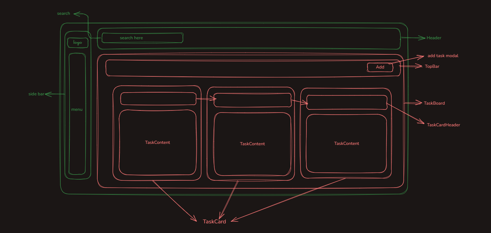
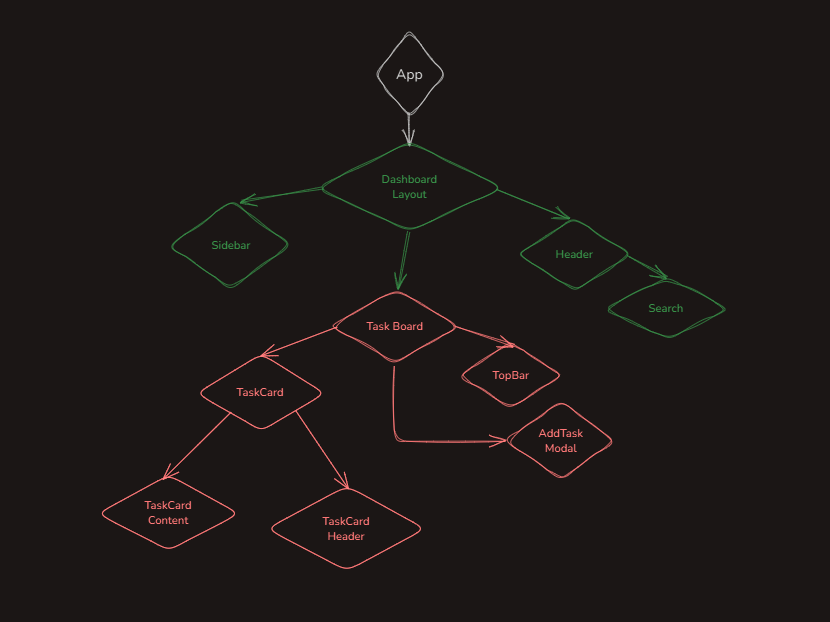

# Project Manager
___

An easy to use Application for managing personal tasks. An user can add, edit and delete tasks as well as view a summery of their todo list.

## Features
___
- Add Task: Create a new task with task name, description, date and category.
- Edit Task: Update existing task by the same form.
- Delete Task: Delete any task from the list.
- Search: Filter task by title using a search bar.
- Sort: Sort task by date within each category.
- Empty State: DisPlay a message "Task list is empty!" when there are no task.

## Technologies Used
___
- React.js
- Tailwind CSS
- Vite

## Component Diagram
___

## Component Tree
___

